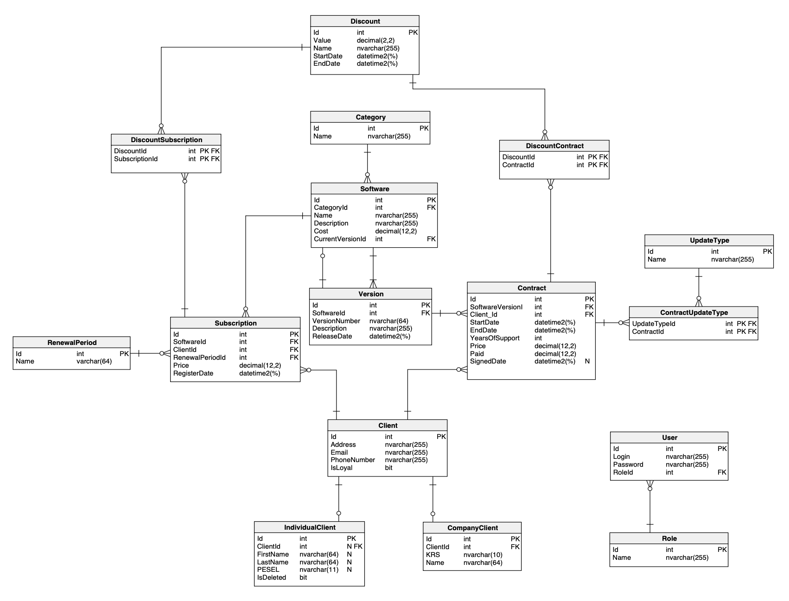

# 💰 Revenue Recognition System

This application tackles a classic challenge in finance: the **revenue recognition problem**.

> Revenue recognition is about determining when you can legitimately record received money in your books. For straightforward sales—like selling a cup of coffee—you record the transaction immediately. But with complex contracts, it's not that simple.

Imagine you pay a retainer upfront for a year of service. Even if the full amount is paid today, you can't recognize all that revenue immediately since the service unfolds over months. Often, revenue is recognized proportionally (e.g., one-twelfth monthly), accounting for scenarios like early contract cancellations.

The rules governing revenue recognition are diverse and ever-changing—shaped by regulations, accounting standards, and company policies—making accurate tracking a complex but crucial task.

Historically, flawed revenue recognition has fueled major corporate scandals, including Enron and WorldCom, causing severe financial and legal repercussions. Reliable revenue recognition systems ensure transparency and uphold trust in financial markets.

---

## 📑 Table of Contents

- [Database Schema](#-database-schema)
- [API Endpoints](#-api-endpoints)
- [Request and Response Bodies](#-request-and-response-bodies)
- [Usage](#-usage)
- [Technologies](#-technologies)
- [License](#-license)

---

## 📌 Database Schema



---

## 🚀 API Endpoints

<!-- List your API endpoints here, e.g.: -->
- `POST /contracts` – Create a new contract

---

## 📬 Request and Response Bodies

### Example: Create Contract Request

```json
```

---

## 📝 Usage
> 1) Clone the repository 
```bash
   git clone https://github.com/antonio-backnotfront/revenue-recognition.git
```  
<br><br>
> 2) Create appsettings.json in the API folder and your database connection string according to this template:
```json
{
  "Logging": {
    "LogLevel": {
      "Default": "Information",
      "Microsoft.AspNetCore": "Warning"
    }
  },
  "AllowedHosts": "*",
  "ConnectionStrings": {
    "DefaultDatabase": "Server=your server;User ID=your user id;Password=your password;TrustServerCertificate=True;Database=your database"
  }
}

```