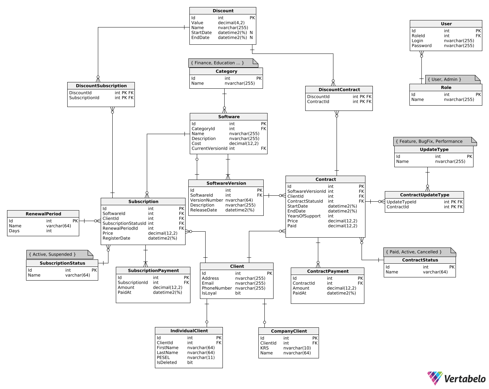

<div align="center">
  <a href="https://github.com/antonio-backnotfront/linear-regression/stargazers">
    
  </a>
  <a href="https://github.com/antonio-backnotfront/linear-regression/issues">
    
  </a>
  <a href="https://github.com/antonio-backnotfront/linear-regression/blob/main/LICENSE.txt">
    
  </a>
<br>
<a href="https://linkedin.com/in/anton-solianyk-906453221">
  
</a>

  <a href="mailto:solyanicks@gmail.com">
    
  </a>
</div>


<h1 align="center">💰 Revenue Recognition System</h1>


This application tackles a classic challenge in finance: the **revenue recognition problem**.

> Revenue recognition is about determining when you can legitimately record received money in your books. For
> straightforward sales—like selling a cup of coffee—you record the transaction immediately. But with complex contracts,
> it's not that simple.

Imagine you pay a retainer upfront for a year of service. Even if the full amount is paid today, you can't recognize all
that revenue immediately since the service unfolds over months. Often, revenue is recognized proportionally (e.g.,
one-twelfth monthly), accounting for scenarios like early contract cancellations.

The rules governing revenue recognition are diverse and ever-changing—shaped by regulations, accounting standards, and
company policies—making accurate tracking a complex but crucial task.

Historically, flawed revenue recognition has fueled major corporate scandals, including Enron and WorldCom, causing
severe financial and legal repercussions. Reliable revenue recognition systems ensure transparency and uphold trust in
financial markets.

---

<h2 align="center"> 📑 Table of Contents </h2>

<p align="center">
    <a href="https://github.com/antonio-backnotfront/revenue-recognition?tab=readme-ov-file#-database-schema">Database Schema</a> •
    <a href="https://github.com/antonio-backnotfront/revenue-recognition?tab=readme-ov-file#-api-endpoints">API Endpoints</a> •
    <a href="https://github.com/antonio-backnotfront/revenue-recognition?tab=readme-ov-file#-request-and-response-bodies">Request and Response Bodies</a> •
    <a href="https://github.com/antonio-backnotfront/revenue-recognition?tab=readme-ov-file#-usage">Usage</a> •
    <a href="https://github.com/antonio-backnotfront/revenue-recognition?tab=readme-ov-file#-technologies">Technologies</a> •
    <a href="https://github.com/antonio-backnotfront/revenue-recognition?tab=readme-ov-file#-license">Licence</a>

</p>


---

## 📌 Database Schema




---

## 📱 API Endpoints

### 🧑‍💼 Clients

<table>
<tr><th>Method</th><th>Endpoint</th><th>Description</th><th>Request Body</th><th>Response Body</th></tr>
<tr><td>GET</td><td>/api/clients</td><td>Get all clients</td><td>–</td><td>List&lt;GetClientResponse&gt;</td></tr>
<tr><td>GET</td><td>/api/clients/{id}</td><td>Get client by ID</td><td>–</td><td>GetClientResponse</td></tr>
<tr><td>POST</td><td>/api/clients</td><td>Create a new client</td><td><a href="#createclientrequest">CreateClientRequest</a></td><td>GetClientResponse</td></tr>
<tr><td>PATCH</td><td>/api/clients/{id}</td><td>Update a client</td><td><a href="#updateclientdto">UpdateClientDto</a></td><td>GetClientResponse</td></tr>
<tr><td>DELETE</td><td>/api/clients/{id}</td><td>Soft-delete a client</td><td>–</td><td>-</td></tr>
</table>

### 📜 Contracts

<table>
<tr><th>Method</th><th>Endpoint</th><th>Description</th><th>Request Body</th><th>Response Body</th></tr>
<tr><td>POST</td><td>/api/contracts</td><td>Create a new contract</td><td><a href="#createcontractrequest">CreateContractRequest</a></td><td>CreateContractResponse</td></tr>
<tr><td>POST</td><td>/api/contracts/{id}/issue-payment</td><td>Pay for a contract</td><td><a href="#createpaymentrequest">CreatePaymentRequest</a></td><td>CreateContractPaymentResponse</td></tr>
</table>

### 🔁 Subscriptions

<table>
<tr><th>Method</th><th>Endpoint</th><th>Description</th><th>Request Body</th><th>Response Body</th></tr>
<tr><td>POST</td><td>/api/subscriptions</td><td>Create a subscription</td><td><a href="#createsubscriptionrequest">CreateSubscriptionRequest</a></td><td>CreateSubscriptionResponse</td></tr>
<tr><td>POST</td><td>/api/subscriptions/{id}/issue-payment</td><td>Pay for a subscription</td><td><a href="#createpaymentrequest">CreatePaymentRequest</a></td><td>CreateSubscriptionPaymentResponse</td></tr>
</table>

### 💰 Revenue

<table>
<tr><th>Method</th><th>Endpoint</th><th>Description</th><th>Request Body</th><th>Response Body</th></tr>
<tr><td>GET</td><td>/api/revenue</td><td>Get actual revenue (optionally filtered)</td><td>–</td><td>{ currentRevenue = 0m }</td></tr>
<tr><td>GET</td><td>/api/revenue/predicted</td><td>Get predicted revenue (actual + expected)</td><td>–</td><td>{ predictedRevenue = 0m }</td></tr>
</table>

--- 

<h2>📦 DTOs as JSON Examples</h2>

<h3>GetClientResponse</h3>
<pre>{
  "id": 0,
  "email": "string",
  "phoneNumber": "string",
  "address": "string",
  "isLoyal": true,
  "companyInformation": {
    "id": 0,
    "name": "string",
    "krs": "string"
  },
  "individualInformation": {
    "id": 0,
    "firstName": "string",
    "lastName": "string",
    "pesel": "string"
  }
}</pre>
<h3>CreateClientRequest</h3>
<pre>{
  "email": "string",
  "phoneNumber": "string",
  "address": "string",
  "companyInformation": {
    "name": "string",
    "krs": "string"
  },
  "individualInformation": {
    "firstName": "string",
    "lastName": "string",
    "pesel": "string"
  }
}</pre>

<h3>UpdateClientDto</h3>
<pre>{
  "email": "string",
  "phoneNumber": "string",
  "address": "string",
  "firstName": "string",
  "lastName": "string",
  "pesel": "string",
  "name": "string",
  "krs": "string"
}</pre>

<h3>CreateContractRequest</h3>
<pre>{
  "clientId": 0,
  "softwareVersionId": 0,
  "startDate": "2025-07-01T00:00:00",
  "endDate": "2025-07-15T00:00:00",
  "yearsOfSupport": 1
}</pre>

<h3>CreateContractResponse</h3>
<pre>{
  "id": 0,
  "clientId": 0,
  "softwareVersionId": 0,
  "startDate": "2025-07-01T00:00:00",
  "endDate": "2025-07-15T00:00:00",
  "yearsOfSupport": 1
}</pre>

<h3>CreateContractPaymentResponse</h3>
<pre>{
  "id": 0,
  "contractId": 0,
  "amount": 0.0,
  "dateOfPayment": "2025-07-01T00:00:00"
}</pre>

<h3>CreateSubscriptionRequest</h3>
<pre>{
  "clientId": 0,
  "softwareId": 0,
  "renewalPeriodId": 1
}</pre>

<h3>CreateSubscriptionResponse</h3>
<pre>{
  "id": 0,
  "clientId": 0,
  "softwareId": 0,
  "renewalPeriodId": 0,
  "subscriptionStatusId": 1,
  "price": 99.99,
  "registerDate": "2025-07-01T00:00:00"
}</pre>

<h3>CreateSubscriptionPaymentResponse</h3>
<pre>{
  "id": 0,
  "subscriptionId": 0,
  "amount": 0.0,
  "dateOfPayment": "2025-07-01T00:00:00"
}</pre>

<h3>CreatePaymentRequest</h3>
<pre>{
  "amount": 199.99
}</pre>


---

## 📝 Usage

> 1) Clone the repository

```bash
   git clone https://github.com/antonio-backnotfront/revenue-recognition.git
```  

<br><br>
> 2) Create appsettings.json in the API folder following to this template:

```json
{
  "Logging": {
    "LogLevel": {
      "Default": "Information",
      "Microsoft.AspNetCore": "Warning"
    }
  },
  "AllowedHosts": "*",
  "ConnectionStrings": {
    "DefaultDatabase": "server = your server; user id = your user id; password = your password; TrustServerCertificate = True; database= your database"
  },
  "CurrencyApi": {
    "key": "your api key"
  },
  "JwtConfig": {
    "Issuer": "issuer",
    "Audience": "audience",
    "Key": "unique key consisting of 32 chars [a-zA-Z]",
    "ValidInMinutes": "integer"
  }
}
```

<br>

> 3) Run

---

## 💻 Technologies

- ASP.NET Core – Backend framework
- Entity Framework Core  (Code-First approach) – ORM for data access and migrations
- Microsoft SQL Server – Database management system
- RESTful API Architecture – Clean and scalable API endpoints
- Postman / Swagger – API testing
- JWT Auth – Secure 'token-based' API access
- xUnit / Moq – Testing

---

## 📄 License

This is free and unencumbered software released into the public domain.

Anyone is free to copy, modify, publish, use, compile, sell, or
distribute this software, either in source code form or as a compiled
binary, for any purpose, commercial or non-commercial, and by any
means.

In jurisdictions that recognize copyright laws, the author or authors
of this software dedicate any and all copyright interest in the
software to the public domain. We make this dedication for the benefit
of the public at large and to the detriment of our heirs and
successors. We intend this dedication to be an overt act of
relinquishment in perpetuity of all present and future rights to this
software under copyright law.

THE SOFTWARE IS PROVIDED "AS IS", WITHOUT WARRANTY OF ANY KIND,
EXPRESS OR IMPLIED, INCLUDING BUT NOT LIMITED TO THE WARRANTIES OF
MERCHANTABILITY, FITNESS FOR A PARTICULAR PURPOSE AND NONINFRINGEMENT.
IN NO EVENT SHALL THE AUTHORS BE LIABLE FOR ANY CLAIM, DAMAGES OR
OTHER LIABILITY, WHETHER IN AN ACTION OF CONTRACT, TORT OR OTHERWISE,
ARISING FROM, OUT OF OR IN CONNECTION WITH THE SOFTWARE OR THE USE OR
OTHER DEALINGS IN THE SOFTWARE.